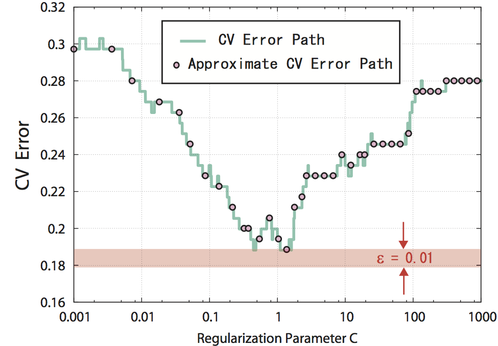

# Regularization Path of Cross-Validation Error Lower Bounds (NIPS'15)

<div align="center">

</div>

An illustration ofthe proposed framework. One of our algorithms automatically selected regularization parameter values in [10^-3, 10^3], and an upper bound of the validation error for each of them is obtained by solving an optimization problem approximately. Among those, the one with the smallest validation error upper bound is guaranteed to be epsilon(= 0.1) approximate regularization parameter in the sense that the validation error for the regularization parameter is no greater by ε than the smallest possible validation error in the whole interval [10^-3, 10^3].

##Abstract

Careful tuning of a regularization parameter is indispensable in many machine learning tasks because it has a significant impact on generalization performances.Nevertheless, current practice of regularization parameter tuning is more of an art than a science, e.g., it is hard to tell how many grid-points would be needed in cross-validation (CV) for obtaining a solution with sufficiently small CV error.In this paper we propose a novel framework for computing a lower bound of the CV errors as a function of the regularization parameter, which we call regularization path of CV error lower bounds.The proposed framework can be used for providing a theoretical approximation guarantee on a set of solutions in the sense that how far the CV error of the current best solution could be away from best possible CV error in the entire range of the regularization parameters.We demonstrate through numerical experiments that a theoretically guaranteed a choice of regularization parameter in the above sense is possible with reasonable computational costs.

##Enviromental Requirement
* gcc version *> 4.8.0*
* cmake version *> 2.8.12*


##How to Compile

```
> cd [problem1 or problem2]
> cmake .
> make test_module
```

## Usage : test_module for problem 1

#### we support [LIBSVM](http://www.csie.ntu.edu.tw/~cjlin/libsvm/) data fortmat only ( [LIBSVM datasets](http://www.csie.ntu.edu.tw/~cjlin/libsvmtools/datasets/) )
- e.g. if you use ionosphere dataset then

  `> wget http://www.csie.ntu.edu.tw/~cjlin/libsvmtools/datasets/ionosphere_scale `

#### Computing approximation level epsilon in cross-validation  (e.g. $ T = 100 $ )
- 1) Grid search
    * `> ./test_module -s 4 -T 100 [datasets_file_name] `
- 2) Bayesian optimization
    * `> ./test_module -s 5 -T 100 [datasets_file_name] `
- 3) Our own method
    * `> ./test_module -s 6 -e 0.05 [datasets_file_name] `


#### Output
  iteration epsilon C UB(E_v)*n' time(sec)

#### Other options

```
Computing approximation level epsilon of
 L2 regularized convex loss minimization's regularized parameter
Usage: ./test_module [options] training_set_file1 [training_set_file2]
                                                  [validation_set_file1]
options:
-s type : set type  (default 3)
  * NOT CV
    1 - 1) grid search
    2 - 2) bayesian optimization
    3 - 3) our own method
  * with cross validation
    4 - 1) grid search
    5 - 2) bayesian optimization
    6 - 3) our own method

-l  : C_l : set  left endpoint of C interval (default 1e-3)
-u  : C_u : set right endpoint of C interval (default 1e+3)

   -n : set the number of trials (T) (default 100)
   -i : the inexact level : set in [1e-6, 1e-1]  (default 1e-3)
  + parameters for baysian optimization
   -g : the number of initial points of gaussian process in
        baysian optimization (default 4)
   -x : the hyperpameter control exploration and exploitation
        in bayesian optimization (default 0.0)


-k fold : set if k-fold Cross Validation case (default 10)
-v : flag whether or not to use validation_set (default false = -1)
     if you use validation_set then specify -v 1

Output (in CV) :
iteration epsilon C UB(E_v)*n' time(sec)
```


## Usage : test_module for problem 2

####we support [LIBSVM](http://www.csie.ntu.edu.tw/~cjlin/libsvm/) data fortmat only ( [LIBSVM datasets](http://www.csie.ntu.edu.tw/~cjlin/libsvmtools/datasets/) )
- e.g. if you use ionosphere dataset then

  `> wget http://www.csie.ntu.edu.tw/~cjlin/libsvmtools/datasets/ionosphere_scale `

####Finding approximately optimal regularization parameter in cross-validation (e.g. $ \epsilon = 0.05 $ )
- op1  `> ./test_module -s 3 -e 0.05 [datasets_file_name] `
- op2  `> ./test_module -s 4 -e 0.05 [datasets_file_name] `
- op3  `> ./test_module -s 5 -e 0.05 [datasets_file_name] `

####Finding optimal regularization parameter in cross-validation
- op1  `> ./test_module -s 10 [datasets_file_name] `
- op3  `> ./test_module -s 11 [datasets_file_name] `

####Tracking Approximate Regularization Path in cross-validation (e.g. $ \epsilon = 0.05 $ )
- op4  `> ./test_module -s 14 -e 0.05 [datasets_file_name] `
- op5  `> ./test_module -s 15 -e 0.05 [datasets_file_name] `

####Tracking Exact Regularization Path in cross-validation
- op4 `> ./test_module -s 14 -e 0.0 [datasets_file_name] `


####Output
  iteration trained_Reguralization_Parameter UB(Ev) E_v^{best} time(sec)

####Other options

```
Usage: ./test_module [options] training_set_file1 [training_set_file2]
                                                  [validation_set_file1]
options:
-s type : set type  (default 2)
  * Finding Approximately Regularization Parameter
    0 - using optimal solution
    1 - using suboptimal solution
    2 - using suboptimal soletion + Trick1 + Trick2

  * Finding Approximately Regularization Parameter in k-fold CV
    3 - op1 using optimal solution
    4 - op2 using suboptimal
    5 - op3 using suboptimal + Trick1 + Trick2

  * Finding Optimal Regularization Parameter
    6 - optimal solution + optimal-bound
    7 - optimal solution + optimal-bound + Trick1
    8 - optimal(ubeve=lbve) solution + suboptimal-bound
    9 - optimal(ubeve=lbve) solution + suboptimal-bound + Trick1

  * Finding Optimal Regularization Parameter for fold CV
   10 - optimal solution + optimal-bound
   11 - optimal solution + optimal-bound + Trick1

  * Tracking Approximately Regularization Path
   12 - optimal solution
   13 - suboptimal solution

  * Tracking Approximately Regularization Path in k-fold CV
   14 - op4 optimal solution
   15 - op5 suboptimal solution

-l C_l : set  left endpoint of C interval (default 1e-3)
-u C_u : set right endpoint of C interval (default 1e+3)
-e epsilon : set in (0,1) (default 0.1)
-p stopping criterion for approximate solution: set in (0, 1) (default 0.1)
-m Trick1 parameter : set integer >= 2 (default 7)
-a Trick2 parameter : set larger than 1 (default 1.5)
-k fold : set if k-fold Cross Validation case (default 10)
-v : flag whether or not to use validation_set (default false = -1)
     if use validation_set then specify -v 1
Output (in CV) :
  iteration trained_Reguralization_Parameter UB(Ev) E_v^{best} time(sec)
```
